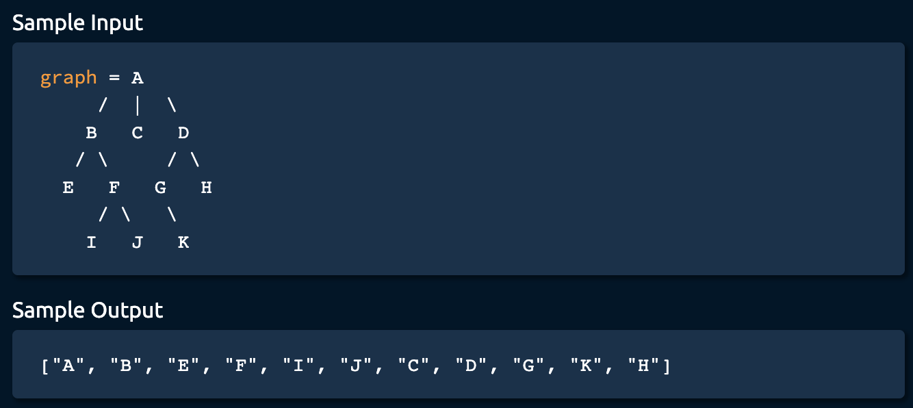

# Depth First Search

## Prompt

Write a function that takes empty array and a root node of a tree.
Each node has name and children properties. name represents a unique value of the node and children represents all children nodes as array. The function returns array that contains name of all node in order of depth first / preorder.

## Example

## Approarch

Depth first search on tree problem tend to be solved by using recursion. The function simply add the current node name to the array and call the function itself on the children of the current node until there is no more child node. Since this problem takes non-binary tree, for loop can be used to iterate throught the children array. When you passed same array into recursive call, the original array will be modified through out the call stack since it's passed by reference.

## Solution

Check the solution.js

## Credit

AlgoExpert easy:
https://www.algoexpert.io/questions/Depth-first%20Search
